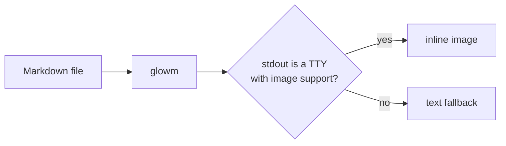
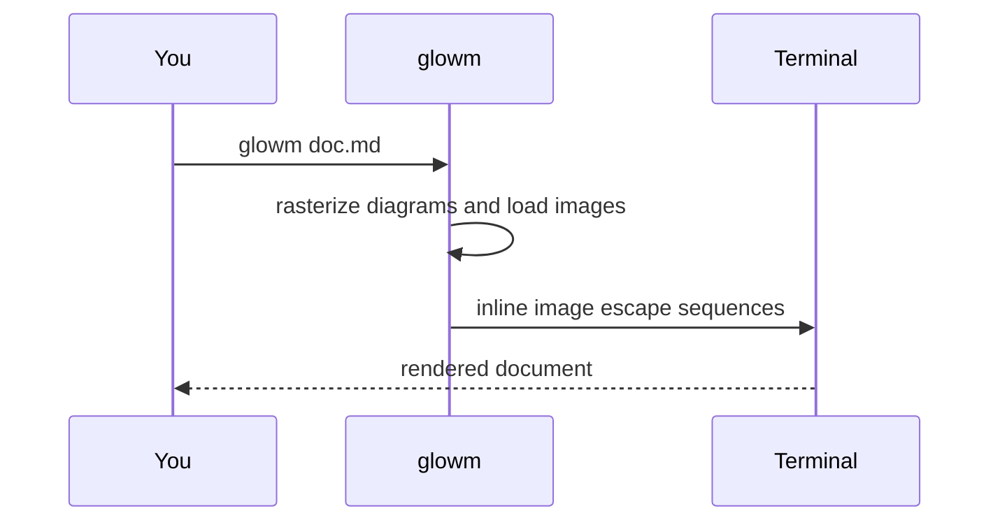
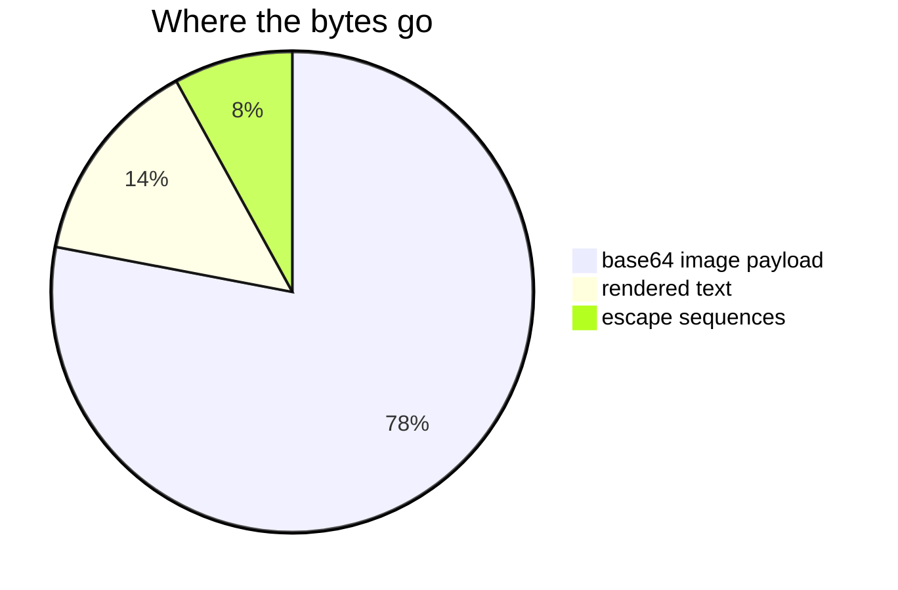

# glowm media demo

Run this on iTerm2, Kitty, or Ghostty to see Mermaid diagrams and Markdown
images rendered inline:

```bash
glowm testdata/media-demo.md
```

Two references in here are meant to fail, so you can see the fallback behaviour
and the warnings on stderr. That is expected.

## Mermaid diagrams

A flowchart:



A sequence diagram, to confirm several diagrams render in one pass:



## Images

A PNG:


A JPEG, which is re-encoded to PNG for the terminal:


A GIF:


Images and diagrams keep their document order, so this diagram appears between
the images above and below it:



A 2400x1350 PNG, downscaled to the display width before encoding:


## What stays as text

An image is only rendered inline when the reference is the only thing on its
line. These deliberately stay as text, because a terminal image occupies whole
rows and cannot sit inside wrapped prose or another block:

Prose around it: here is  mid-sentence.

- A list item: 
- Another item, for contrast

> A blockquote: 

| Column |
| --- |
|  |

A fenced code block is left completely alone:

```markdown

```

## Failure cases

A missing file, which renders as a description with a warning on stderr:


A remote image, which is not fetched:


## Wrapping up

Text after all of the media, to confirm the document continues normally.
